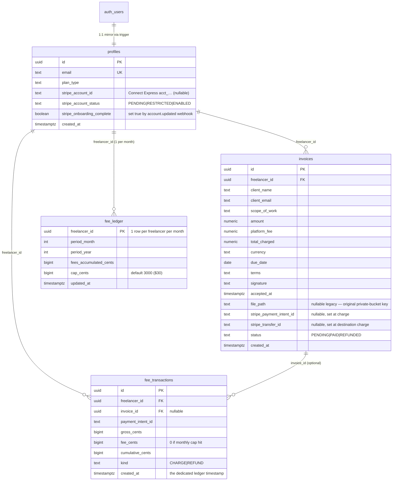

# CiteFlow — Supabase Database Schema Migration

> Source-of-truth SQL for `public.profiles` and `public.invoices` plus
> Row-Level Security policies and an auth-triggered profile-sync function.
>
> **How to use:** copy the entire SQL block below and paste it into the
> **Supabase Dashboard → SQL Editor → New query**, then click **Run**.
> It is idempotent and safe to re-run.
>
> Companion document: [`storage-setup.md`](./storage-setup.md) — manual setup
> of the **private** `deliverables` Storage bucket.

---

## Design summary



| Concern | Decision |
|---|---|
| Profile sync | `handle_new_user()` `SECURITY DEFINER` trigger fires `AFTER INSERT ON auth.users` and inserts `id + email` only (no user-supplied columns). |
| `profiles` RLS | Owner-only SELECT / INSERT / UPDATE / DELETE via `auth.uid() = id`. |
| `invoices` freelancer RLS | Full CRUD only on rows where `auth.uid() = freelancer_id`. |
| `invoices` client access | Anonymous + authenticated may SELECT any row by `id` (single-row lookup enforced at the app/API layer). `file_path` is a private-object key, never a public URL. |
| Stripe Connect | `profiles.stripe_account_id` (optional String, `acct_…`) + `profiles.stripe_onboarding_complete` boolean (set by the `account.updated` webhook once `charges_enabled && details_submitted`). `stripe_account_status` enum is the source-of-truth; the boolean is a cheap redundant predicate. |
| Invoice Stripe bookkeeping | `invoices.stripe_payment_intent_id` + `invoices.stripe_transfer_id` written at charge time so the webhook reconciles without extra joins. Both nullable until PAID. |
| Platform fee ledger | `fee_ledger` (per freelancer per calendar month, cap = $30 = 3000 cents) + append-only `fee_transactions` journal (`invoice_id`, `freelancer_id`, `fee_cents`, `payment_intent_id`, `kind`, `created_at` timestamp). Capped 5% application fee enforced atomically by the `compute_fee_cents()` SECURITY DEFINER RPC. |
| File confidentiality | `deliverables` Storage bucket is **private**; the service role mints short-lived (`60s`) signed URLs. See [`storage-setup.md`](./storage-setup.md). |
| Financial integrity | `NUMERIC(10,2)` for the per-invoice money columns + a `CHECK` that `total_charged = amount + platform_fee`. Ledger money is stored as integer `bigint` cents to avoid float drift. |

---

## Indexed performance & safety

- `invoices_freelancer_id_idx` — every list view per freelancer.
- `invoices_client_email_idx` — client lookups & receipts lookups.
- `invoices_status_idx` — dashboard counts (`PENDING` / `PAID`).
- `profiles.email UNIQUE` — prevents duplicate signup rows if a trigger retries.
- `profiles.id` references `auth.users.id ON DELETE CASCADE` — auto-cleans on user deletion.

---

## Complete SQL — paste into Supabase SQL Editor

```sql
-- ============================================================================
-- CiteFlow — Supabase Database Migration
-- Tables:  public.profiles, public.invoices
-- Security:Row-Level Security on every table, least-privilege policies
-- Auth:    trigger auto-creates a profile row on user signup
-- Storage: assumes a PRIVATE bucket named "deliverables" (see storage-setup.md)
-- Idempotent; safe to re-run.
-- ============================================================================

-- 0. Extensions -------------------------------------------------------------
-- gen_random_uuid() lives in pgcrypto. Supabase ships it; ensure it's enabled.
create extension if not exists pgcrypto;

-- 1. profiles  --------------------------------------------------------------
create table if not exists public.profiles (
    id                          uuid primary key references auth.users (id) on delete cascade,
    email                       text not null unique,
    plan_type                   text not null default 'FREE'
                                  check (plan_type in ('FREE', 'PREMIUM')),
    -- Stripe Connect Express account id (`acct_…`). Nullable until the
    -- freelancer kicks off onboarding for the first time.
    stripe_account_id          text,
    -- Authoritative Stripe capability state; flipped by the account.updated
    -- webhook. PENDING = account created, charges not yet enabled.
    stripe_account_status      text not null default 'PENDING'
                                  check (stripe_account_status in ('PENDING', 'RESTRICTED', 'ENABLED')),
    -- Boolean mirror of (stripe_account_status = 'ENABLED'). Convenience
    -- predicate for the dashboard gate; never the sole source of truth.
    stripe_onboarding_complete boolean not null default false,
    created_at                  timestamptz not null default now()
);

comment on table  public.profiles is 'One row per authenticated freelancer, auto-synced from auth.users on signup.';
comment on column public.profiles.plan_type is 'Subscription tier. FREE = default, PREMIUM = paid plan.';

-- 2. invoices ---------------------------------------------------------------
create table if not exists public.invoices (
    id                        uuid primary key default gen_random_uuid(),
    freelancer_id             uuid not null references public.profiles (id) on delete cascade,
    client_name               text not null,
    client_email              text not null,
    scope_of_work             text,                                    -- Phase 2: replaces the file paywall payload
    amount                    numeric(10, 2) not null,
    platform_fee              numeric(10, 2) not null,
    total_charged             numeric(10, 2) not null,
    currency                  text not null default 'usd',           -- ISO-4217 lowercase
    due_date                  date,                                   -- nullable for "no due date"
    terms                     text,
    signature                 text,                                   -- client-typed digital signature
    accepted_at               timestamptz,                            -- terms acceptance timestamp
    file_path                 text,                                   -- nullable: private bucket object key (legacy rows), never a raw public URL
    -- Stripe bookkeeping for destination-charge reconciliation. Both nullable
    -- until the invoice transitions to PAID; the webhook stamps them at
    -- `payment_intent.succeeded`.
    stripe_payment_intent_id  text,
    stripe_transfer_id        text,
    status                    text not null default 'PENDING'
                                check (status in ('PENDING', 'PAID', 'REFUNDED')),
    created_at                timestamptz not null default now()
);

comment on column public.invoices.scope_of_work            is 'Free-text scope replacing the Phase-1 file paywall payload.';
comment on column public.invoices.currency                is 'ISO-4217 lowercase currency code (usd, eur, gbp, inr, …).';
comment on column public.invoices.stripe_payment_intent_id is 'Stripe PaymentIntent id at charge time. Nullable until PAID.';
comment on column public.invoices.stripe_transfer_id      is 'Stripe Transfer id (destination-charge payout to the connected account). Nullable until PAID.';

comment on column public.profiles.stripe_account_id          is 'Stripe Connect Express account id (acct_…). Nullable until onboarding kickoff.';
comment on column public.profiles.stripe_account_status      is 'Authoritative Stripe capability enum (PENDING / RESTRICTED / ENABLED).';
comment on column public.profiles.stripe_onboarding_complete is 'Boolean mirror of stripe_account_status = ENABLED for cheap dashboard gating.';
comment on table  public.invoices is 'Invoice + locked deliverable reference. Clients view via signed UUID link; files served through signed Storage URLs only.';
comment on column public.invoices.amount                    is 'Amount owed to the freelancer (excl. platform fee). NUMERIC for exact financial math.';
comment on column public.invoices.platform_fee              is 'Platform fee retained by ClientLockbox at charge time (capped application fee).';
comment on column public.invoices.total_charged             is 'Total charged to the client = amount + platform_fee.';
comment on column public.invoices.file_path                 is 'Object key inside the PRIVATE "deliverables" bucket. Nullable since Phase 2 (scope_of-work-first model).';

-- Defensive integrity: total must equal amount + fee so the service layer
-- can never silently corrupt bookkeeping. Kept NOT VALID (see phase2-migration)
-- so legacy rows don't block the constraint.
do $$
begin
    if not exists (
      select 1 from pg_constraint where conname = 'invoices_total_matches_components'
    ) then
        alter table public.invoices
            add constraint invoices_total_matches_components
            check (total_charged = (amount + platform_fee)) not valid;
    end if;
end $$;

create index if not exists invoices_freelancer_id_idx            on public.invoices (freelancer_id);
create index if not exists invoices_client_email_idx             on public.invoices (client_email);
create index if not exists invoices_status_idx                   on public.invoices (status);
create index if not exists invoices_due_date_idx                 on public.invoices (due_date);
create index if not exists invoices_freelancer_status_idx        on public.invoices (freelancer_id, status);
create index if not exists invoices_stripe_payment_intent_idx    on public.invoices (stripe_payment_intent_id);

-- 2b. fee_ledger + fee_transactions (PlatformFee / ledger) -------------------
-- Dedicated bookkeeping for the capped 5% application fee. `fee_ledger` is a
-- one-row-per-freelancer-per-month running total (cap = 3000 cents = $30);
-- `fee_transactions` is the immutable append-only journal — one row per
-- charge or refund event with the exact `fee_amount_in_cents` applied and the
-- `created_at` timestamp. Mirrors the spec: invoiceId, freelancerId,
-- feeAmountInCents, timestamp (+ payment_intent_id, kind, cumulative_cents).
create table if not exists public.fee_ledger (
    freelancer_id           uuid primary key references public.profiles (id) on delete cascade,
    period_month            int  not null check (period_month between 1 and 12),
    period_year             int  not null,
    fees_accumulated_cents  bigint not null default 0,
    cap_cents               bigint not null default 3000,
    updated_at              timestamptz not null default now()
);
create unique index if not exists fee_ledger_period_uniq
    on public.fee_ledger (freelancer_id, period_year, period_month);

create table if not exists public.fee_transactions (
    id                    uuid primary key default gen_random_uuid(),
    freelancer_id         uuid not null references public.profiles (id) on delete cascade,
    invoice_id            uuid references public.invoices (id) on delete set null,
    payment_intent_id     text,
    gross_cents           bigint not null,
    fee_cents             bigint not null,        -- fee_amount_in_cents; 0 if cap hit
    cumulative_cents      bigint not null,        -- running total for the period after this row
    period_month          int not null,
    period_year           int not null,
    kind                  text not null check (kind in ('CHARGE', 'REFUND')),
    created_at            timestamptz not null default now()  -- the ledger timestamp
);
create index if not exists fee_transactions_fl_idx
    on public.fee_transactions (freelancer_id, period_year, period_month);
create index if not exists fee_transactions_pi_idx
    on public.fee_transactions (payment_intent_id);
create index if not exists fee_transactions_invoice_idx
    on public.fee_transactions (invoice_id);

comment on table  public.fee_ledger       is 'Per-freelancer per-calendar-month running total of platform fees; enforces the $30/month cap.';
comment on column public.fee_ledger.cap_cents is 'Monthly cap in cents. Default 3000 = $30/month per freelancer.';
comment on table  public.fee_transactions is 'Immutable append-only journal of every fee applied (CHARGE) or reversed (REFUND). One row per ledger event.';

-- Note: the `compute_fee_cents()` SECURITY DEFINER RPC that atomically reads +
-- updates fee_ledger and appends a fee_transactions row lives in
-- `plans/phase2-migration.md`. It is intentionally NOT redefined here to keep
-- a single source of truth for the function body.

-- 3. Automated profile sync trigger -----------------------------------------
-- SECURITY DEFINER: runs as the postgres-owner role so it can insert into
-- public.profiles during signup before the user's session is usable.
-- Only inserts id + email copied from auth.users (no user-controlled input),
-- so this is safe. Keep the signature minimal; re-audit if you add columns.

create or replace function public.handle_new_user()
returns trigger
language plpgsql
security definer
set search_path = public
as $$
begin
    insert into public.profiles (id, email)
    values (new.id, new.email)
    on conflict (id) do nothing;          -- resilient to retried signups
    return new;
end;
$$;

drop trigger if exists on_auth_user_created on auth.users;
create trigger on_auth_user_created
    after insert on auth.users
    for each row execute function public.handle_new_user();

comment on function public.handle_new_user() is 'Auto-inserts a public.profiles row whenever Supabase Auth registers a new user.';

-- 4. Row-Level Security -----------------------------------------------------
alter table public.profiles       enable row level security;
alter table public.invoices       enable row level security;
alter table public.fee_ledger     enable row level security;
alter table public.fee_transactions enable row level security;

-- Optional hardening for production: force RLS even for table owners so a
-- compromised service role still respects policies in day-to-day code paths.
-- Uncomment when you no longer need the service role to bypass RLS cleanly.
-- alter table public.profiles  force row level security;
-- alter table public.invoices  force row level security;

-- 4.1 profiles: owner-only CRUD ---------------------------------------------
create policy "profiles_select_own"
    on public.profiles for select
    using (auth.uid() = id);

create policy "profiles_insert_own"
    on public.profiles for insert
    with check (auth.uid() = id);

create policy "profiles_update_own"
    on public.profiles for update
    using (auth.uid() = id)
    with check (auth.uid() = id);

create policy "profiles_delete_own"
    on public.profiles for delete
    using (auth.uid() = id);

-- 4.2 invoices: freelancer full CRUD on own invoices ------------------------
create policy "invoices_select_own"
    on public.invoices for select
    using (auth.uid() = freelancer_id);

create policy "invoices_insert_own"
    on public.invoices for insert
    with check (auth.uid() = freelancer_id);

create policy "invoices_update_own"
    on public.invoices for update
    using (auth.uid() = freelancer_id)
    with check (auth.uid() = freelancer_id);

create policy "invoices_delete_own"
    on public.invoices for delete
    using (auth.uid() = freelancer_id);

-- 4.3 invoices: the "Crucial Client Exception" ------------------------------
-- Decision (confirmed with user): anonymous users can SELECT any invoice row
-- by its `id`. The application layer MUST perform single-row lookups only,
-- e.g. `select * from invoices where id = $1`, and must NOT expose any listing
-- endpoint that returns multiple rows to anonymous clients.
--
-- Because RLS is row-based, an anon `select * from invoices` with no filter
-- would in principle return every row this policy allows. We accept that risk
-- because:
--   * the invoice UUID is a 122-bit secret act of knowledge
--   * even if row metadata leaks, the locked PDF bytes stay private because
--     the Storage bucket is private and signed URLs are minted server-side
--     via the service role key (see storage-setup.md)
--
-- If you want a stricter DB-level guarantee, switch to the alternative
-- `public_invoices` SECURITY DEFINER view approach at the bottom of this file.
create policy "invoices_select_public_by_id"
    on public.invoices for select
    to anon, authenticated
    using (true);   -- row gate open; app contract enforces single-row lookup

-- 4.4 fee_ledger + fee_transactions: owner-readable; service-role writable --
-- These are platform bookkeeping tables; freelancers may READ their own rows
-- (for the dashboard "fees used this month" pill). Writes happen exclusively
-- through the `compute_fee_cents()` SECURITY DEFINER RPC (called by the
-- webhook) or the service role — no direct INSERT/UPDATE/DELETE policy is
-- granted to ordinary users.
drop policy if exists "fee_ledger_select_own"        on public.fee_ledger;
drop policy if exists "fee_transactions_select_own"  on public.fee_transactions;

create policy "fee_ledger_select_own"
    on public.fee_ledger for select
    using (auth.uid() = freelancer_id);

create policy "fee_transactions_select_own"
    on public.fee_transactions for select
    using (auth.uid() = freelancer_id);

-- ============================================================================
-- ALTERNATIVE: view-based anon access (kept for future hardening)
-- ----------------------------------------------------------------------------
-- If you later decide the anon table-scan risk is unacceptable, drop the
-- `invoices_select_public_by_id` policy above and use this instead:
--
-- create or replace view public.public_invoices as
--   select id, client_name, client_email, amount, total_charged, status
--   from public.invoices;
--
-- alter view public.public_invoices owner to postgres;
-- grant select on public.public_invoices to anon, authenticated;
-- revoke select on public.invoices from anon;
-- -- file_path is intentionally absent from the view, so anonymous users
-- -- can never learn the storage object key. Sign-URL issuance still happens
-- -- via the service role on the base `invoices` table.
-- ============================================================================
```

---

## Notes on the SQL

- **`handle_new_user()` uses `SECURITY DEFINER`** deliberately, not `SECURITY INVOKER`. During signup the new user's `auth.uid()` exists but their RLS policy hasn't been tested yet against `public.profiles` — using `SECURITY DEFINER` with the `postgres` owner guarantees the row is inserted once and once only. The function body copies only `id` and `email` from `auth.users` (no user-controlled values), so the elevated privilege is safe.
- **`on conflict (id) do nothing`** in the trigger makes retried signups no-op rather than throwing.
- **`invoices_total_matches_components` CHECK** is wrapped in a `do $$ … end $$` block so re-running the script doesn't fail with "constraint already exists".
- **`invoices_select_public_by_id` is the only anonymous-granting policy.** If you ever need to remove anon read access, drop just that policy — everything else is owner-scoped.
- **No `force row level security`** is set by default, so the **service role** (which bypasses RLS) can still mint signed Storage URLs for any `file_path` regardless of caller. This is required for the signed-URL flow described in [`storage-setup.md`](./storage-setup.md).

---

## Verification queries (run after migration)

```sql
-- 1. Tables + RLS status
select tablename, rowsecurity
from pg_tables
where schemaname = 'public'
  and tablename in ('profiles', 'invoices', 'fee_ledger', 'fee_transactions');

-- 2. Active policies
select schemaname, tablename, policyname, cmd, roles
from pg_policies
where schemaname = 'public'
order by tablename, policyname;

-- 3. Trigger registered?
select tgname, tgrelid::regclass as on_table, tgenabled
from pg_trigger
where tgname = 'on_auth_user_created';

-- 4. Money constraint present?
select conname, pg_get_constraintdef(oid)
from pg_constraint
where conname = 'invoices_total_matches_components';

-- 5. Stripe Connect columns present on profiles?
select column_name, data_type, is_nullable
from information_schema.columns
where table_schema = 'public' and table_name = 'profiles'
  and column_name in ('stripe_account_id', 'stripe_account_status', 'stripe_onboarding_complete');

-- 6. Stripe bookkeeping columns present on invoices?
select column_name, data_type, is_nullable
from information_schema.columns
where table_schema = 'public' and table_name = 'invoices'
  and column_name in ('stripe_payment_intent_id', 'stripe_transfer_id');

-- 7. Platform-fee ledger columns present on fee_transactions?
select column_name, data_type
from information_schema.columns
where table_schema = 'public' and table_name = 'fee_transactions'
  and column_name in ('invoice_id', 'freelancer_id', 'fee_cents', 'payment_intent_id', 'created_at');
```

---

## Storage bucket setup

See [`plans/storage-setup.md`](./storage-setup.md) for the step-by-step Supabase Dashboard walkthrough for the **private** `deliverables` bucket, including Storage RLS policies and a server-side signed-URL skeleton.
