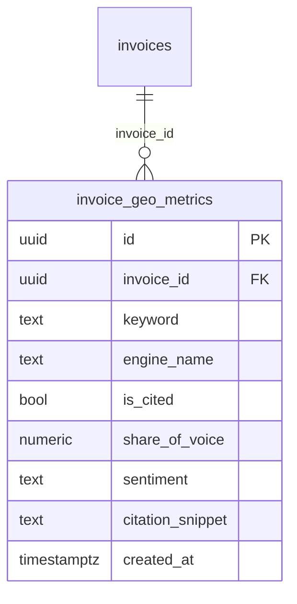

# CiteFlow — `invoice_geo_metrics` Supabase Migration

> Phase 1 — premium AI-engine citation visual dashboard data layer.
>
> **How to use:** copy the entire SQL block below and paste it into the
> **Supabase Dashboard → SQL Editor → New query**, then click **Run**.
> It is idempotent and safe to re-run.
>
> Companion documents:
> - [`plans/database-schema.md`](./database-schema.md) — `profiles` + `invoices`.
> - [`plans/storage-setup.md`](./storage-setup.md) — private `deliverables` bucket.

---

## Design summary



| Concern | Decision |
|---|---|
| Public key | The invoice `id` (UUID) **is** the public key — consistent with the existing `/share/[id]` model (see `invoices_select_public_by_id` in [`database-schema.md`](./database-schema.md)). No separate `public_key` column on `invoices`. |
| Freelancer RLS | Full CRUD (`SELECT/INSERT/UPDATE/DELETE`) only on rows whose linked invoice belongs to `auth.uid()`. |
| Anonymous RLS | `anon` may SELECT only. Row gate is `USING (true)`; the application layer MUST publish only single-invoice queries of the form `WHERE invoice_id = $1`. No INSERT/UPDATE/DELETE grant to `anon`. |
| Engine cardinality | CHECK constraint pins `engine_name` to `'CHATGPT','PERPLEXITY','GEMINI','CLAUDE'`. |
| Sentiment | CHECK constraint pins to `'POSITIVE','NEUTRAL','NEGATIVE'`, default `'NEUTRAL'`. |
| Financial-precision bound | `share_of_voice NUMERIC(5,2)` stores 0.00–100.00 inclusive. |

---

## Complete SQL — paste into Supabase SQL Editor

```sql
-- ============================================================================
-- CiteFlow — invoice_geo_metrics Migration
-- Table:   public.invoice_geo_metrics (polymorphic GEO citation metrics)
-- Links:   invoice_id -> public.invoices(id) ON DELETE CASCADE
-- Security:Row-Level Security enabled; freelancer full CRUD + anon read-only
-- Idempotent; safe to re-run.
-- ============================================================================

-- 0. Extensions --------------------------------------------------------------
-- gen_random_uuid() lives in pgcrypto. Supabase ships it; ensure it's enabled.
create extension if not exists pgcrypto;

-- 1. invoice_geo_metrics -----------------------------------------------------
create table if not exists public.invoice_geo_metrics (
    id                uuid primary key default gen_random_uuid(),
    invoice_id        uuid not null references public.invoices (id) on delete cascade,
    keyword           text not null,
    engine_name       text not null
                        check (engine_name in ('CHATGPT', 'PERPLEXITY', 'GEMINI', 'CLAUDE')),
    is_cited          boolean not null default false,
    share_of_voice    numeric(5, 2) not null default 0.00
                        check (share_of_voice >= 0 and share_of_voice <= 100),
    sentiment         text not null default 'NEUTRAL'
                        check (sentiment in ('POSITIVE', 'NEUTRAL', 'NEGATIVE')),
    citation_snippet  text,
    created_at        timestamptz not null default now()
);

comment on table  public.invoice_geo_metrics is 'Polymorphic GEO/AI-engine citation metrics powering the premium citation visual dashboard. One row per (invoice, keyword, engine).';
comment on column public.invoice_geo_metrics.invoice_id       is 'Owning invoice. CASCADE deletes roll up metric rows automatically.';
comment on column public.invoice_geo_metrics.keyword          is 'The search keyword / query string this metric row describes.';
comment on column public.invoice_geo_metrics.engine_name      is 'AI citation engine. Pinned to the supported set via CHECK.';
comment on column public.invoice_geo_metrics.is_cited        is 'True when the engine actually cited the linked deliverable for this keyword.';
comment on column public.invoice_geo_metrics.share_of_voice  is 'Share-of-voice percentage 0.00–100.00. NUMERIC(5,2) for exact math.';
comment on column public.invoice_geo_metrics.sentiment        is 'Detected sentiment of the citation. NEUTRAL by default.';
comment on column public.invoice_geo_metrics.citation_snippet is 'Optional verbatim snippet of the engine citation. Nullable.';

-- 2. Indexes -----------------------------------------------------------------
create index if not exists invoice_geo_metrics_invoice_id_idx
    on public.invoice_geo_metrics (invoice_id);

create index if not exists invoice_geo_metrics_engine_idx
    on public.invoice_geo_metrics (engine_name);

-- Composite: the dashboard's most common query is "metrics for invoice X,
-- broken down by engine".
create index if not exists invoice_geo_metrics_invoice_engine_idx
    on public.invoice_geo_metrics (invoice_id, engine_name);

-- 3. Row-Level Security ------------------------------------------------------
alter table public.invoice_geo_metrics enable row level security;

-- Optional hardening for production: force RLS even for table owners so a
-- compromised service role still respects policies in day-to-day code paths.
-- Uncomment when you no longer need the service role to bypass RLS cleanly
-- (the simulate-payment route uses the service role on `invoices`, NOT here).
-- alter table public.invoice_geo_metrics force row level security;

-- 3.1 Freelancer: full CRUD only on metrics linked to an invoice they own ---
-- A single EXISTS subquery ties each metric row back to the owning invoice and
-- then to auth.uid(). Used for both USING (row visibility) and WITH CHECK
-- (write acceptance) so the same predicate governs every command.

create policy "invoice_geo_metrics_owner_all"
    on public.invoice_geo_metrics for all
    to authenticated
    using (
        exists (
            select 1 from public.invoices i
            where i.id = invoice_geo_metrics.invoice_id
              and i.freelancer_id = auth.uid()
        )
    )
    with check (
        exists (
            select 1 from public.invoices i
            where i.id = invoice_geo_metrics.invoice_id
              and i.freelancer_id = auth.uid()
        )
    );

-- 3.2 Anonymous: read-only, scoped to a single invoice via the public UUID ---
-- RLS is row-based and cannot accept bind parameters, so the policy uses
-- USING (true) for SELECT-only, exactly mirroring the established precedent
-- `invoices_select_public_by_id` (see database-schema.md). The application
-- layer MUST only ever publish single-row queries of the form
-- `select * from invoice_geo_metrics where invoice_id = $1` to anonymous
-- callers; it MUST NOT expose any listing endpoint that returns multiple
-- invoices' rows to anon. No INSERT / UPDATE / DELETE policy is created for
-- `anon`, so anonymous writes are rejected by default-deny.
--
-- The invoice UUID is a 122-bit unguessable secret — the same act of
-- knowledge that already gates `/share/[id]`.

create policy "invoice_geo_metrics_public_select_by_invoice"
    on public.invoice_geo_metrics for select
    to anon
    using (true);
```

---

## Verification queries (run after migration)

```sql
-- 1. Table + RLS status
select tablename, rowsecurity
from pg_tables
where schemaname = 'public' and tablename = 'invoice_geo_metrics';

-- 2. Active policies (expect 2: owner_all + public_select_by_invoice)
select policyname, cmd, roles
from pg_policies
where schemaname = 'public' and tablename = 'invoice_geo_metrics'
order by policyname;

-- 3. Indexes present
select indexname
from pg_indexes
where schemaname = 'public' and tablename = 'invoice_geo_metrics';

-- 4. Constraints (engine_name + sentiment + share_of_voice checks, FK)
select conname, contype, pg_get_constraintdef(oid)
from pg_constraint
where conrelid = 'public.invoice_geo_metrics'::regclass
order by conname;

-- 5. Sanity: anon must be denied writes (this should raise a permission error
--    if you run it as the anon role):
-- set role anon;
-- insert into public.invoice_geo_metrics (invoice_id, keyword, engine_name)
--   values ('00000000-0000-0000-0000-000000000000', 'test', 'CHATGPT');
-- reset role;
```

---

## Notes on the SQL

- **`invoice_geo_metrics_owner_all` covers all four commands** (`for all`) with a matching `USING` + `WITH CHECK`, so a freelancer who owns the *linked invoice* can read, insert, update, and delete the metric rows. No owner-less row can ever be visible or writable.
- **Anon default-deny on writes**: because no `for insert / for update / for delete` policy targets `anon`, Supabase's default-deny means anonymous writes are rejected even though `using (true)` opens the SELECT lane.
- **`ON DELETE CASCADE`** means deleting an invoice (which is itself only allowed for the owning freelancer under `invoices_delete_own`) automatically removes its metric rows — no orphaned GEO data.
- **`gen_random_uuid()`** is sourced from `pgcrypto` (explicitly enabled at the top of the script).
- The optional `force row level security` line is intentionally **not** set, leaving the service role able to bypass RLS if a future server routine needs to seed metrics without a user session.

---

## Alternative strict view (kept for future hardening)

If you later decide the anon table-scan risk is unacceptable, drop the
`invoice_geo_metrics_public_select_by_invoice` policy and use a
single-invoice `SECURITY DEFINER` function instead:

```sql
-- create or replace function public.get_invoice_geo_metrics(p_invoice_id uuid)
-- returns setof public.invoice_geo_metrics
-- language sql security definer set search_path = public as $$
--   select * from public.invoice_geo_metrics where invoice_id = p_invoice_id;
-- $$;
-- grant execute on function public.get_invoice_geo_metrics(uuid) to anon;
-- revoke select on public.invoice_geo_metrics from anon;
```

This pins anonymous access to a single-invoice lookup at the DB level rather
than relying on the application contract.
