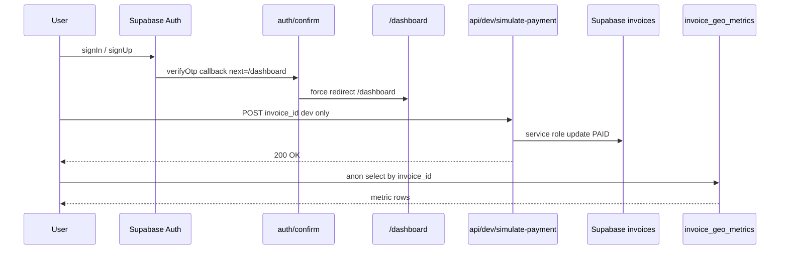

# CiteFlow — Phase 1 Architecture & Implementation Plan

> Reviewed files: [`components/login-form.tsx`](components/login-form.tsx:1),
> [`components/sign-up-form.tsx`](components/sign-up-form.tsx:1),
> [`app/auth/confirm/route.ts`](app/auth/confirm/route.ts:1),
> [`app/dashboard/layout.tsx`](app/dashboard/layout.tsx:1),
> [`app/dashboard/page.tsx`](app/dashboard/page.tsx:1),
> [`app/api/dev-bypass/route.ts`](app/api/dev-bypass/route.ts:1),
> [`app/api/webhook/route.ts`](app/api/webhook/route.ts:1),
> [`lib/supabase/admin.ts`](lib/supabase/admin.ts:1),
> [`app/share/[id]/page.tsx`](app/share/[id]/page.tsx:1),
> [`app/share/[id]/paywall-client.tsx`](app/share/[id]/paywall-client.tsx:1),
> [`plans/database-schema.md`](plans/database-schema.md:1).

---

## System context (as-built)

```mermaid
flowchart LR
    A[Client Browser] -->|signUp signIn| B[Supabase Auth]
    B -->|emailOTP callback| C[app/auth/confirm/route.ts]
    C -->|redirect next| D[Target Route]
    A -->|create invoice| E[app/dashboard/page.tsx]
    E --> F[components/dashboard-client.tsx]
    A -->|/share/id| G[app/share/[id]/page.tsx]
    G --> H[paywall-client.tsx]
    H -->|Stripe| I[app/api/checkout/route.ts]
    I --> J[Stripe Hosted Checkout]
    J -->|webhook| K[app/api/webhook/route.ts]
    K -->|service role PAID| L[Supabase invoices table]
    H -->|dev bypass| M[app/api/dev-bypass/route.ts]
    M -.->|N1 New route| N[app/api/dev/simulate-payment/route.ts]
    L --> O[invoice_geo_metrics N1 New table]
```

---

## Root-cause findings

1. **Auth redirect loop to landing page**
   - [`components/login-form.tsx:42`](components/login-form.tsx:42) — `router.push("/protected")` — wrong target.
   - [`components/sign-up-form.tsx:47`](components/sign-up-form.tsx:47) — `emailRedirectTo: .../protected` — wrong target.
   - [`app/auth/confirm/route.ts:10`](app/auth/confirm/route.ts:10) — `next` defaults to `"/"` (the **landing page**), which has no cookie-session gate, so a logged-in user landing on `/` and then hitting auth again loops back.
   - There is **no `middleware.ts`**, so session refresh relies entirely on the per-route guards in [`app/dashboard/layout.tsx`](app/dashboard/layout.tsx:30). The boilerplate `/protected/*` route is not the real CiteFlow dashboard.

2. **GEO metrics table does not exist.**
   - `public.invoices` (`id`, `freelancer_id`, `client_name`, `client_email`, `amount`, `platform_fee`, `total_charged`, `file_path`, `status`, `created_at`) has no metrics child table. No `public_key` column exists.
   - Per requirement decision: **the invoice `id` (UUID) itself is the public key** — consistent with the existing `/share/[id]` model. No schema change to `invoices`.

3. **Dev-bypass route exists but is misplaced & slightly mis-spec'd.**
   - [`app/api/dev-bypass/route.ts`](app/api/dev-bypass/route.ts:1) is reasonably hardened but:
     - Returns **404** on failure (task explicitly requests a **403 Unauthorized** in production).
     - Lives at `/api/dev-bypass` — task requires `/api/dev/simulate-payment/route.ts`.
   - The client hook [`paywall-client.tsx:132`](app/share/[id]/paywall-client.tsx:132) POSTs to the old path and must repoint.
   - **No client-side `invoices.update` write exists** — invoice-status writes only happen server-side (`webhook`, `dev-bypass`). The "remove client-side write hooks" requirement is already satisfied; the implementation must **audit & enforce** this (no new client `.update` lanes) rather than delete existing ones.

---

## STEP 1 — DATABASE SCHEMA UPGRADE & REPAIR

Create [`plans/geo-metrics-migration.md`](plans/geo-metrics-migration.md) — a paste-ready Supabase SQL Editor migration to create `public.invoice_geo_metrics`.

### Table DDL

- `id` UUID PK default `gen_random_uuid()`
- `invoice_id` UUID NOT NULL → `public.invoices(id) ON DELETE CASCADE`
- `keyword` TEXT NOT NULL
- `engine_name` TEXT NOT NULL — CHECK IN (`'CHATGPT','PERPLEXITY','GEMINI','CLAUDE'`)
- `is_cited` BOOLEAN default `false`
- `share_of_voice` NUMERIC(5,2) default `0.00`
- `sentiment` TEXT CHECK IN (`'POSITIVE','NEUTRAL','NEGATIVE'`), default `'NEUTRAL'`
- `citation_snippet` TEXT nullable
- `created_at` TIMESTAMPTZ default `now()`

### Indexes

- `invoice_geo_metrics_invoice_id_idx` (`invoice_id`)
- `invoice_geo_metrics_engine_idx` (`engine_name`)
- composite `invoice_geo_metrics_invoice_engine_idx` (`invoice_id`, `engine_name`)

### RLS

- `ALTER TABLE ... ENABLE ROW LEVEL SECURITY`
- **Freelancer policy (ALL ops)** `invoice_geo_metrics_owner_all` — `TO authenticated USING (EXISTS (SELECT 1 FROM public.invoices i WHERE i.id = invoice_geo_metrics.invoice_id AND i.freelancer_id = auth.uid())) WITH CHECK (same)`.
- **Anon read-only policy** `invoice_geo_metrics_public_select_by_invoice` — `TO anon SELECT USING (invoice_id = $1)`-equivalent. RLS cannot accept bind params; the policy uses `USING (true)` constrained **by the app layer** to single-invoice `WHERE invoice_id = $1` queries — mirroring the existing `invoices_select_public_by_id` decision ([`plans/database-schema.md:217`](plans/database-schema.md:217)). No INSERT/UPDATE/DELETE grant to `anon`.

### Post-migration verification block

Queries to confirm RLS, policies, and the FK.

---

## STEP 2 — FIX THE AUTHENTICATION REDIRECT LOOPS

Rewrite all success handlers to **forcefully redirect to `/dashboard`** with hardened fallback boundaries.

### 2a. [`components/login-form.tsx`](components/login-form.tsx:42)
- Replace `router.push("/protected")` → `router.push("/dashboard")`.
- Add a `router.refresh()`-aware guard: after `signInWithPassword` success, also verify session by re-fetching; if `error` from a stale session, fall back to `window.location.href = "/dashboard"` (hard full-page navigation) to break any client-side router cache loop.
- Error boundary: wrap try/catch; on non-Error thrown, surface a generic localized message + log.

### 2b. [`components/sign-up-form.tsx`](components/sign-up-form.tsx:47)
- Replace `emailRedirectTo: ${origin}/protected` → `${origin}/auth/confirm?next=/dashboard`.
- Keep `router.push("/auth/sign-up-success")` for the immediate post-submit state.
- Add password-strength + email-regex pre-flight validation errors.

### 2c. [`app/auth/confirm/route.ts`](app/auth/confirm/route.ts:10)
- Change default `next` from `"/"` → `"/dashboard"`.
- **Open-redirect hardening**: validate `next` against an allowlist — must start with a single leading `/`, must not start with `//`, and must not contain a scheme/host. If invalid, force `next = "/dashboard"`.
- After `verifyOtp` success, use `redirect(next)` (server-side, forceful).
- On `verifyOtp` error → `redirect("/auth/error?error=" + encodeURIComponent(error.message))`.
- On missing `token_hash`/`type` → `redirect("/auth/error?error=missing_token")`.
- Wrap the whole handler in a try/catch that redirects to the error page on any unexpected throw (never leaves the user on a blank screen).

### 2d. (Recommended) Add [`middleware.ts`](middleware.ts:1)
- Optional hardening: a Supabase-aware middleware that refreshes sessions on every request and redirects authenticated users hitting `/` to `/dashboard`, and unauthenticated users hitting `/dashboard` to `/auth/login`. This eliminates the "logged-in user lands on root" loop. This is additive and marked optional in the todo list.

---

## STEP 3 — SECURE SERVER-SIDE DEVELOPMENT BYPASS ENGINE

### 3a. New route [`app/api/dev/simulate-payment/route.ts`](app/api/dev/simulate-payment/route.ts:1)
- Accept `POST { invoice_id }`.
- **Production guard**: if `process.env.NODE_ENV !== 'development'` OR `process.env.DEV_BYPASS_ENABLED !== 'true'` → immediately return `NextResponse.json({ error: 'Unauthorized' }, { status: 403 })` (explicit 403 per spec). No other behavior leaks.
- Parse & validate JSON body; reject missing/non-string `invoice_id` with 400.
- Use [`createAdminClient()`](lib/supabase/admin.ts:14) (service role) to:
  1. `select id, status from invoices where id = $1 single()` — 404 if not found.
  2. If already `PAID` → idempotent 200 `{ ok, already_paid: true }`.
  3. `update { status: 'PAID' } eq('id', invoiceId) eq('status','PENDING')` (idempotency guard mirrors [`webhook/route.ts:93`](app/api/webhook/route.ts:93)).
  4. Return 200 `{ ok: true }` to trigger hard UI state sync.
- Server-only error logging via `console.error`.

### 3b. Repoint the client hook
- Update [`paywall-client.tsx:132`](app/share/[id]/paywall-client.tsx:132) — `fetch("/api/dev-bypass", ...)` → `fetch("/api/dev/simulate-payment", ...)`.

### 3c. Remove the old route
- Delete [`app/api/dev-bypass/route.ts`](app/api/dev-bypass/route.ts:1) and its empty parent dir once Step 3a + 3b land, so there is exactly one bypass path.

### 3d. Audit & lock client-side writes (Step 3 requirement)
- Confirm no `.tsx`/`.ts` client module performs `.from('invoices').update(...)` — verified: only `webhook/route.ts` and `dev-bypass`/`simulate-payment` server routes do this.
- Add an ESLint zero-tolerance rule (or a code comment + review checklist) that bans client imports of `createAdminClient` and bans client calls to `invoices.update`. The import path `@/lib/supabase/admin` is already documented server-only ([`lib/supabase/admin.ts:11`](lib/supabase/admin.ts:11)).

---

## Type & import integrity checklist

- `DashboardInvoiceRow`, `PublicInvoiceView` types unchanged.
- New `SimulatePaymentResponse` type exported from the new route for client typing (optional `ok`, `error`, `already_paid`).
- Verify `next.config.ts`/`tsconfig.json` paths resolve `@lib/supabase/*` and `@components/*` aliases.
- `process.env.NODE_ENV` is a Next.js build-time constant for client code → remains tree-shakeable for the dev-bypass button branch in [`paywall-client.tsx:27`](app/share/[id]/paywall-client.tsx:27).
- Add `DEV_BYPASS_ENABLED` note to `.env.local` (server-only, NOT `NEXT_PUBLIC_`) — the server route reads `DEV_BYPASS_ENABLED`; the client button already reads `NEXT_PUBLIC_DEV_BYPASS_ENABLED`. Keep both consistent.

---

## Mermaid — final target flow (post Phase 1)



---

## Out of scope (deferred)

- Building the actual AI-engine citation **visual dashboard UI** (only the table + RLS + types land in Phase 1).
- Migrating the boilerplate `/protected/*` route to `/dashboard` is not needed — we redirect to `/dashboard` directly and leave `/protected` as-is (or delete separately).
- Stripe production webhook signature enforcement is already present ([`webhook/route.ts`](app/api/webhook/route.ts:1)); no change.
