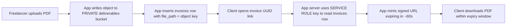

# CiteFlow — Storage Bucket Setup (`deliverables`)

This guide walks through creating the **private** Supabase Storage bucket that
holds locked freelancer deliverables (PDF reports) referenced by
[`invoices.file_path`](../plans/database-schema.sql). The bucket is intentionally
**not** public so that clients can never guess or browse object URLs — they only
receive short-lived **signed URLs** generated server-side by the service role key.

> Do this once, by hand, in the Supabase Dashboard after running
> [`plans/database-schema.sql`](./database-schema.sql).

---

## High-level flow



---

## Step-by-step (Supabase Dashboard)

1. **Open your project** at https://app.supabase.com → select the
   `CiteFlow` project (URL host `difrpkmutgfgoslwmfjg`).

2. In the left sidebar click **Storage**.

3. Click the **New bucket** button (top right of the bucket list).

4. Fill in the dialog:
   - **Name:** `deliverables`  *(must match exactly — referenced in app code)*
   - **Public bucket:** toggle **OFF** ← critical, this keeps objects private.
   - **File size limit:** set to a sensible cap (e.g. `50 MB`) so a malicious
     freelancer can't upload an enormous object to bloat storage costs.
   - **Allowed MIME types:** `application/pdf` only, since deliverables are PDFs.

5. Click **Create bucket**.

6. Verify privacy: open the bucket, click the **⚙️ (three dots) → Edit bucket**
   and confirm "Public bucket" is unchecked. In a private bucket, object URLs of
   the form `https://…/storage/v1/object/public/deliverables/…` will return
   `401 / 403` — only signed URLs minted with the **service role key** will work.

---

## Storage Row-Level Security (RLS) policies

Supabase Storage supports per-bucket RLS. Add these in **Storage → Policies →
`deliverables` bucket** (or paste the SQL below into the SQL Editor). They ensure
freelancers only manage their own files, while clients can never bypass the
signed-URL flow.

```sql
-- The Storage RLS examples below use the PostgREST helpers auth.uid() and
-- storage.foldername(). The path convention we adopt is:
--   {freelancer_id}/{invoice_id}.pdf
-- so the first path segment is always the owning freelancer's id.

-- 1) Authenticated freelancers can create objects inside their own folder
create policy "deliverables_insert_own"
  on storage.objects for insert
  to authenticated
  with check (
    bucket_id = 'deliverables'
    and (storage.foldername(name))[1] = auth.uid()::text
  );

-- 2) Authenticated freelancers can SELECT (read metadata) of their own files
create policy "deliverables_select_own"
  on storage.objects for select
  to authenticated
  using (
    bucket_id = 'deliverables'
    and (storage.foldername(name))[1] = auth.uid()::text
  );

-- 3) Authenticated freelancers can overwrite/update their own files
create policy "deliverables_update_own"
  on storage.objects for update
  to authenticated
  using (
    bucket_id = 'deliverables'
    and (storage.foldername(name))[1] = auth.uid()::text
  )
  with check (
    bucket_id = 'deliverables'
    and (storage.foldername(name))[1] = auth.uid()::text
  );

-- 4) Authenticated freelancers can delete their own files
create policy "deliverables_delete_own"
  on storage.objects for delete
  to authenticated
  using (
    bucket_id = 'deliverables'
    and (storage.foldername(name))[1] = auth.uid()::text
  );

-- 5) IMPORTANT: deliberately grant NO anon/authenticated SELECT that bypasses
--    ownership. Clients receive files exclusively via signed URLs minted by
--    the service role, which ignores RLS.
```

> If Supabase does not yet have `storage.foldername()` exposed in your project's
> policies UI, use the text-pattern check instead:
> `(storage.foldername(name))[1] = auth.uid()::text`
> handles a single top-level folder; you can switch to
> `name like auth.uid()::text || '/%'` if a helper is unavailable.

---

## Path convention (must match your app code)

Every object uploaded to `deliverables` uses the path:

```
{freelancer_id}/{invoice_id}.pdf
```

- `freelancer_id` is the first path segment, which the Storage RLS policies use
  to verify the uploader owns the folder.
- `invoice_id` is the UUID stored in [`public.invoices`](./database-schema.sql),
  also used as the shareable client link (`/invoice/{invoice_id}`).
- The full path is stored in the `file_path` column of `public.invoices`.

---

## Signed URL issuance (server-side checklist)

This happens in Next.js route handlers / server actions — **never** with the
anon key. A recommended skeleton (do NOT run this in the browser):

```ts
import { createClient } from '@supabase/supabase-js'

// SERVICE ROLE key only — never expose to the client.
const admin = createClient(
  process.env.NEXT_PUBLIC_SUPABASE_URL!,
  process.env.SUPABASE_SERVICE_ROLE_KEY!,        // server-only env var
  { auth: { persistSession: false, autoRefreshToken: false } }
)

async function getDeliverableSignedUrl(invoiceId: string, viewerEmail: string) {
  // 1. Load the invoice row (service role bypasses RLS).
  const { data: invoice, error } = await admin
    .from('invoices')
    .select('file_path, client_email, status')
    .eq('id', invoiceId)
    .single()
  if (error || !invoice) throw new Error('Invoice not found')

  // 2. Verify the viewer is the intended client; optionally require status PAID.
  if (invoice.client_email !== viewerEmail) throw new Error('Forbidden')
  // if (invoice.status !== 'PAID') throw new Error('Invoice not paid')

  // 3. Mint a short-lived signed URL.
  const { data, error: signErr } = await admin
    .storage
    .from('deliverables')
    .createSignedUrl(invoice.file_path, 60)        // 60-second expiry

  if (signErr || !data) throw new Error('Could not sign URL')
  return data.signedUrl
}
```

Add `SUPABASE_SERVICE_ROLE_KEY` to your server-side environment (do **not**
prefix with `NEXT_PUBLIC_`). The existing file
[`lib/supabase/server.ts`](../lib/supabase/server.ts) uses the anon/publishable
key for normal requests; create a sibling `lib/supabase/admin.ts` that turns off
session persistence when wiring the service role client.

---

## Why a private bucket is mandatory for this app

| Leakage vector | Result if public | Result if private |
|---|---|---|
| Client guesses another invoice's UUID | Finds the `file_path` belonging to a *different* client's invoice (only if app lists rows). | Same metadata leak possible, but **file bytes remain inaccessible** without a signed URL. |
| Object URL hardcoded into a template | Anyone with the URL downloads the PDF forever. | Without a freshly signed token the URL returns `401`. |
| Old links forwarded via email/screenshots | Permanent share. | Expired after 60s. |

The pairing of a **private bucket** + **server-side signed URLs** + the
**single-row-by-id** app-level contract is what makes CiteFlow genuinely
"locked."
